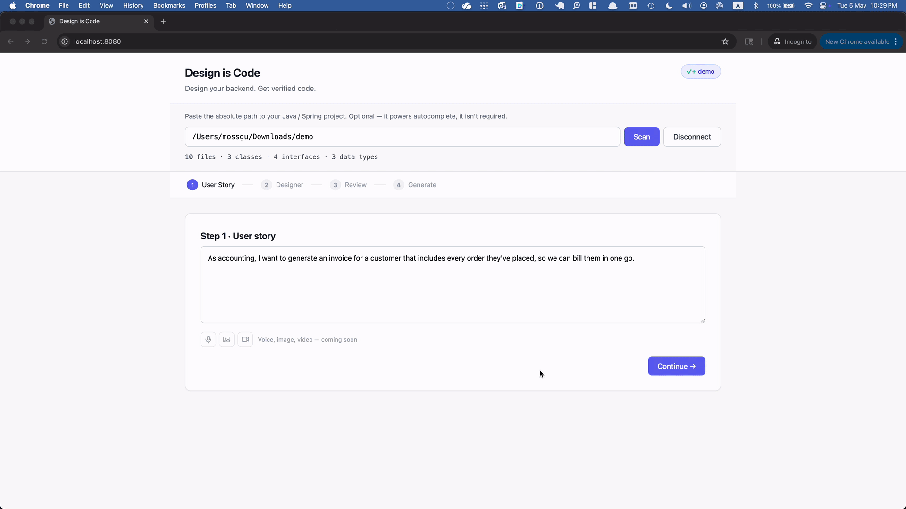
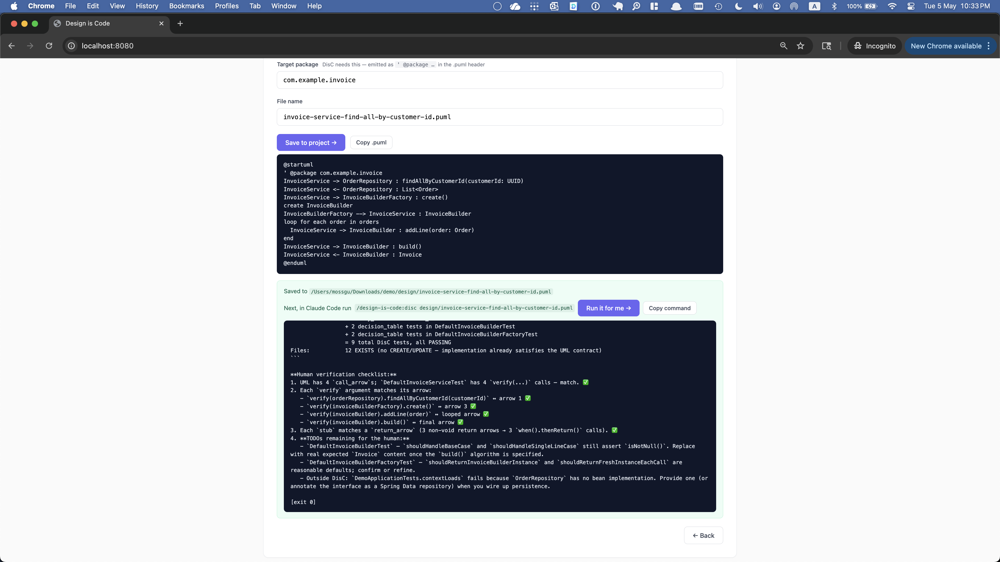

# DisC Studio

The companion editor for the [DisC](https://github.com/mossgreen/design-is-code-plugin) methodology. Compose a sequence-diagram-driven design — participants, methods, decision tables, calls, loops, creates — and emit the `.puml` (plus any `.decision.md` sidecars) that DisC consumes to generate tests and implementation.

DisC Studio is intentionally thin: DisC owns codegen; the Studio owns design authoring.

## Demo

End-to-end: composing a design in DisC Studio, generating the `.puml`, and shelling out to DisC.



DisC's output — tests and implementation produced from the `.puml`:



## What you need

DisC Studio is a **front-end for the DisC codegen plugin**. It writes designs into an existing Java project; DisC (separately installed) reads those designs and generates source. To use the Studio end-to-end you need:

### 1. Java 21 or newer · required

DisC Studio runs on Spring Boot 4, which requires JDK 21+. Older JDKs fail at startup with `UnsupportedClassVersionError`.

Check what you have:
```sh
java -version
```

Install if needed:
- [SDKMAN](https://sdkman.io/) — `sdk install java 21-tem`
- [Adoptium / Temurin](https://adoptium.net/temurin/releases/?version=21) — direct downloads for any platform

### 2. A Java/Spring project to save designs into · required

DisC Studio writes the `.puml` and any `.decision.md` sidecars into your project's `design/` folder, alongside the source code being designed. It also reads the project's package layout to suggest target packages on Step 4.

**Evaluating without an existing project?** The same Release ships [`disc-studio-starter.zip`](https://github.com/mossgreen/design-is-code-app/releases/latest) — a minimal Spring Boot scaffold (Spring Initializr export, ~55KB) with one `com.example.demo` package and an empty `design/` folder. Unzip anywhere, point the Studio at the unzipped folder, and you're set.

### 3. Claude Code + the `design-is-code` plugin · optional

Required only for Step 4's "Run it for me" button, which shells out to:
```sh
claude --dangerously-skip-permissions -p /design-is-code:disc <file>
```
…and streams DisC's output back into the app. Without it, the rest of the editor works exactly the same — you save the `.puml` and run DisC yourself (terminal, another IDE, anywhere the [`design-is-code` plugin](https://github.com/mossgreen/design-is-code-plugin) is installed).

## Quick start

1. From the [latest Release](https://github.com/mossgreen/design-is-code-app/releases/latest), download:
   - `disc-studio-<version>.jar` — the app itself (required).
   - `disc-studio-starter.zip` — only if you don't have an existing Java/Spring project to design against. Unzip anywhere.

2. Run the app from any directory:
   ```sh
   java -jar disc-studio-0.4.2.jar
   ```

3. Open <http://localhost:8080>. Click the **Connect project** chip in the header and paste the absolute path to your Java project (or to the unzipped starter folder).

4. Click **Load simple demo** to seed Steps 1-3 with a worked invoice-generation flow, then walk through to Step 4 and save. The `.puml` lands in your project's `design/` folder.

`Ctrl-C` in the terminal stops the app.

## How it works

Four steps, top to bottom:

1. **User Story** — write the natural-language requirement.
2. **Designer** — define participants (interfaces with typed methods), then compose the call sequence one interaction at a time. Live SVG preview updates as you go.
3. **Review** — read-only snapshot: story, participant list, frozen diagram. The hand-off point.
4. **Generate** — pick the target Java package, name the file, save into your project's `design/` folder, and run `/design-is-code:disc <file>` from Claude Code (or click "Run it for me" if you have the plugin installed).

## Development

Build and run from source:
```sh
./gradlew bootRun
```

Then open <http://localhost:8080>. To produce the redistributable jar:
```sh
./gradlew bootJar
# build/libs/disc-studio-<version>.jar
```

**Stack:** Spring Boot 4 / Java 21 / vanilla HTML+CSS+JS / hand-rolled SVG. No frontend build step.

**E2E tests** live in [`e2e/`](e2e/) (Playwright against a running app). Start the app in one terminal, then in another: `cd e2e && npm install && npx playwright install chromium && npx playwright test`.

**Releasing:** see [RELEASE.md](RELEASE.md).

## Status

Early/POC. Single-user, localhost-only. No persistence — refreshing the browser loses your work.
